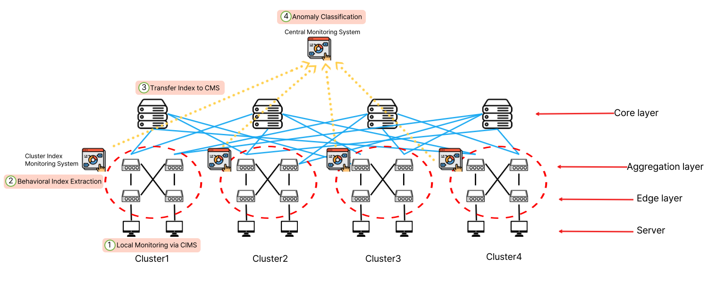
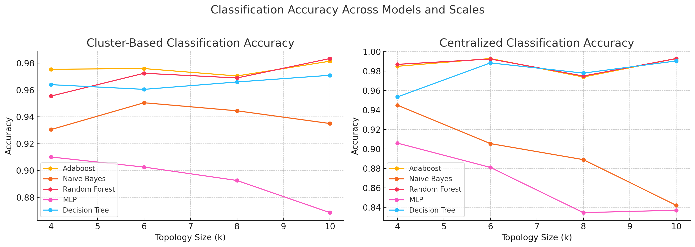
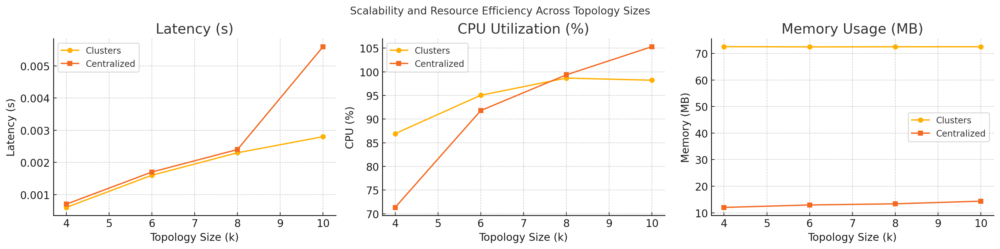

## Cluster-Based Detection of Compromised SDN Controller Using Behavioral Divergence

This repository supports the paper **"Cluster-Based Detection of Compromised SDN Controller Using Behavioral Divergence"**, which introduces a scalable, localized anomaly detection framework for SDN environments.

---

### 📝 Overview

Software-Defined Networking (SDN) offers centralized programmability, but this centralization makes the controller a critical point of failure. If compromised, a controller may issue malicious flow rules while staying OpenFlow-compliant, making traditional detection methods ineffective—especially in large-scale networks.

We propose a **cluster-based anomaly detection method** that leverages the hierarchical and localized traffic nature of data centers.

---

### 📌 Architecture

The detection process is carried out in four steps:

1. **Local Monitoring** at each pod using the Cluster Index Monitoring System (CIMS)  
2. **Behavioral Index Extraction** from flow table and packet activity  
3. **Transfer of index vectors** to the central monitoring server  
4. **Anomaly Classification** based on inter-cluster divergence  

---

### 📊 Behavioral Indexes

To characterize cluster behavior, five statistical indexes are used:

- **SPI**: Switch Participation Index  
- **PFSI**: Priority Frequency Spike Index  
- **TFSI**: Timeout Frequency Spike Index  
- **PPR**: Packet Processing Ratio  
- **PPD**: Packet Processing Divergence  

These indexes are computed per cluster and compared using **Max Pairwise Distance (MPD)** to capture abnormal divergence.

---

### 🎯 Classification Accuracy

Extensive evaluation shows that the cluster-based method provides more **stable and scalable accuracy** compared to centralized detection, especially as topology size increases.

---

### ⚙️ Scalability and Resource Efficiency

Compared to centralized approaches, the proposed method achieves:

- Lower latency
- Lower CPU usage at scale
- Consistently low memory footprint

---

### ✅ Conclusion

The proposed cluster-based detection framework achieves **high accuracy with significantly improved scalability** and resource efficiency. This makes it well-suited for large-scale SDN deployments in modern data center environments.

Future directions include support for multi-controller systems and adaptation to evolving attack strategies.

---

> 📎 For detailed implementation, refer to the code and usage instructions below.
